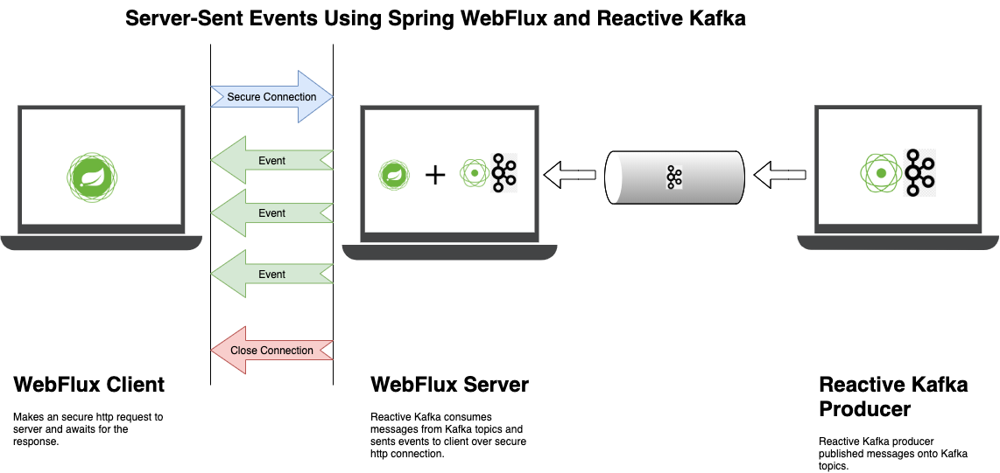

### My ref. links
* [Reactor Kafka Reference Guide](https://projectreactor.io/docs/kafka/release/reference/#_reactor_kafka_api)
  Reactive Kafka is a reactive API for Kafka based on project Reactor and the Kafka producer/Consumer API. It enables data to be published and consumed from Kafka using functional API with non-blocking back pressure and low overheads which allows reactive Kafka to be integrated with other reactor systems and provide an end-end reactive pipeline.

# server-sent-events
WebFlux Server using the Spring WebFlux framework and reactive Kafka which exposes a REST API for the clients to make secure HTTP requests. Once a secure connection is established between the client and the web flux server, it consumes messages from Kafka topics and pushes the data asynchronously without closing connection with the client unless required.

Take a look at the this [medium blog](https://medium.com/egen/server-sent-events-using-spring-webflux-and-reactive-kafka-1a7ddbca4f5d) on Spring WebFlux using Reactive Kafka.

## Run
* Make a sample request to this server using a curl command on the terminal, which keeps the connection alive.
  > curl --location --request GET 'localhost:8080/sse' \
  --header 'Content-Type: text/event-stream;charset=UTF-8' \
  --header 'Accept: text/event-stream;charset=UTF-8'

* Open a Kafka consumer
  > docker exec --interactive --tty broker1 \
  kafka-console-consumer --bootstrap-server broker1:9092 \
  --topic NewTopic1 \
  --from-beginning

* Generate Events - test data
  Run springboot-kafka-1 project  